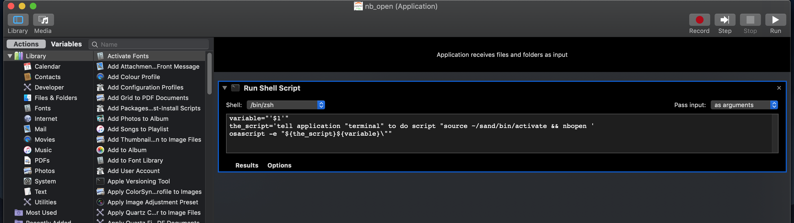

# Open-JupyterNotebooks-with-doubleclick-MAC
Set a default app to launch a clicked jupyter notebook in a python virtual environment.  
(Instructions for MAC users)

You'll need virtual environment manager for python, so that juypter knowns where to install + import python packages from when you use the notebooks.

## Setting up: follow the screenshot which is taken from this [stackoverflow post](https://stackoverflow.com/questions/30953227/double-click-to-open-an-ipython-notebook)

1. Open Mac "Automator" Utilities App.
2. Create new app
3. Drag and drop "Run shell script"
4. Change pass input to "as arguements"
5. Paste the below, adapted code from the stack overflow link above, to use your set up virtual environment for python (see prerequisite steps below for how to do this).
```
variable="'$1'"
the_script='tell application "terminal" to do script "source ~/sand_py394/bin/activate && nbopen '
osascript -e "${the_script}${variable}\""
```

6. Save the app to your Applications folder
7. Right click a .ipynb notebook file and open with your app from the app folder, select "always open with"
8. Then Right click the same jupyter file and click "Get Info"
9. Select "Apply to All/ Always open" toggle
10. Now whenever you double click a .ipynb file, it will start take you straight to the web browser, without faffing around with anaconda or the terminal each time.

Note: if you want to use Anaconda instead of PYenv for the virtual environment, just change the code you pasted into the Automator app: change `~/sand_py394/bin/activate` to `conda activate <name_of_your_anaconda_environment>`.

## Prerequisites

### installl command line tools for Mac
`xcode-select --install`  

### Download and install [homebrew](https://brew.sh/) from their website

### install python dependencies:
`brew install openssl readline sqlite3 xz zlib`  

### Install [pipenv](https://github.com/pyenv/pyenv) using homebrew.
This will let you set up different virtual environments with different versions of python installed, allowing you to keep upgrading to the latest python versions for new projects, but keep old python versions for old projects so they still work.
```
brew update && brew install pyenv
echo 'eval "$(pyenv init --path)"' >> ~/.zprofile
echo 'eval "$(pyenv init -)"' >> ~/.zshrc
```

### Install python version:
1. Check latest available python versions:
`pyenv install -l | grep '^  3'`
2. install the latest version e.g:
`pyenv install 3.9.4`

### Install [pyenv-virtualenv](https://github.com/pyenv/pyenv-virtualenv):
`brew install pyenv-virtualenv`  
`echo alias brew='env PATH="${PATH//$(pyenv root)\/shims:/}" brew' >> .zshrc`
`echo eval "$(pyenv virtualenv-init -)" >> .zshrc`  

### create virtual env
`pyenv virtualenv 3.9.4 ~/sand_py394`

### set up jupyter and activate virtual env
`source ~/sand_py394/bin/activate`  
`pip install --upgrade pip`  
`pip install jupyter-notebook`  
`python3 -m pip install nbopen`  
`deactivate`  
**Now it's ready.**
